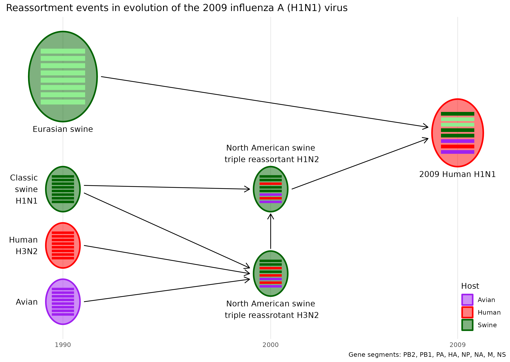

# Visualization Tool for Genetic Reassortment

Provides useful functions for visualizing virus reassortment events.

## :writing_hand: Authors

Guangchuang YU <https://yulab-smu.top>

School of Basic Medical Sciences, Southern Medical University


## Installation

```r
BiocManager::install("seqcombo")
```

## Usages


```r
library(tibble)
library(ggplot2)


n <- 8

virus_info <- tibble(
    id = 1:7,
    x = c(rep(1990, 4), rep(2000, 2), 2009),
    y = c(1,2,3,5, 1.5, 3, 4),
    segment_color = list(
        rep('purple', n),
        rep('red', n),
        rep('darkgreen', n),
        rep('lightgreen', n),
        c('darkgreen', 'darkgreen', 'red', 'darkgreen', 'red', 'purple', 'red', 'purple'),
        c('darkgreen', 'darkgreen', 'red', 'darkgreen', 'darkgreen', 'purple', 'red', 'purple'),
        c('darkgreen', 'lightgreen', 'lightgreen', 'darkgreen', 'darkgreen', 'purple', 'red', 'purple'))
)

flow_info <- tibble(from = c(1,2,3,3,4,5,6),
                    to = c(5,5,5,6,7,6,7))

virus_info$Host = c("Avian", "Human", rep("Swine", 4), "Human")
virus_info$label <- c("Avian", "Human\nH3N2", "Classic\nswine\nH1N1", "Eurasian swine",
                      "North American swine\n triple reassrotant H3N2",
                      "North American swine\n triple reassortant H1N2", "2009 Human H1N1")
virus_info$label_position <- c('left', 'left', 'left', 'below', 'below', 'upper', 'below')
virus_info$virus_size <- c(rep(1, 3), 2, 1, 1, 1.5)

title <- "Reassortment events in evolution of the 2009 influenza A (H1N1) virus"
caption <- 'Gene segments: PB2, PB1, PA, HA, NP, NA, M, NS'
color <- c(Avian="purple", Human="red", Swine="darkgreen")

hybrid_plot(virus_info, flow_info, v_color=~Host, v_fill=~Host, asp=2) +
    labs(caption=caption, title=title) +
    scale_color_manual(values=color) + scale_fill_manual(values=color) +
    scale_x_continuous(breaks=c(1990, 2000, 2009)) +
    xlab(NULL) + ylab(NULL) + theme_minimal() +
    theme(axis.line.y = element_blank(),
          axis.text.y = element_blank(),
          axis.ticks.y = element_blank(),
          panel.grid.minor=element_blank(),
          panel.grid.major.y=element_blank(),
          legend.position = c(.95, .1)
          )
```




