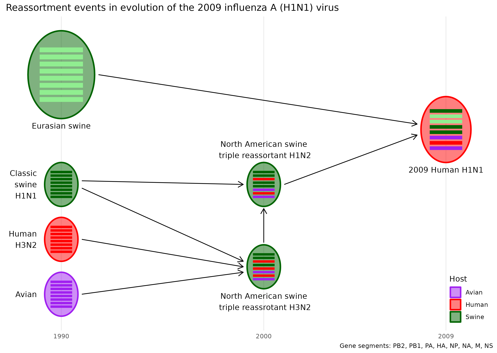

# Visualization Tool for Genetic Reassortment

Provides useful functions for visualizing virus reassortment events.

## :writing_hand: Authors

Guangchuang YU <https://yulab-smu.top>

School of Basic Medical Sciences, Southern Medical University


## Installation

```r
BiocManager::install("seqcombo")
```

## Recommended workflow

For most new analyses, the recommended path is:

1. Start from long-format tables with one row per virus-segment record.
2. Build `virus_info` and `flow_info` with `build_virus_info_from_long()` and
   `build_flow_info_from_long()`.
3. Bundle them with `as_seqcombo_data()`.
4. Plot with `autoplot()` for a fast default figure, or switch to
   `hybrid_plot()` when you want full control over aesthetics.

```r
library(ggplot2)
library(seqcombo)

segment_df <- data.frame(
    id = rep(c("avian_1990", "human_1990", "swine_2000"), each = 8),
    sample_time = rep(c(1990, 1990, 2000), each = 8),
    segment = rep(c("PB2", "PB1", "PA", "HA", "NP", "NA", "M", "NS"), 3),
    color = c(
        rep("purple", 8),
        rep("red", 8),
        c("darkgreen", "darkgreen", "red", "darkgreen",
          "darkgreen", "purple", "red", "purple")
    ),
    host = rep(c("Avian", "Human", "Swine"), each = 8),
    stringsAsFactors = FALSE
)

flow_df <- data.frame(
    from = c("avian_1990", "human_1990"),
    to = c("swine_2000", "swine_2000"),
    segment = c("HA", "NA"),
    stringsAsFactors = FALSE
)

virus_info <- build_virus_info_from_long(
    segment_df,
    x = "sample_time",
    keep = "host"
)
flow_info <- build_flow_info_from_long(flow_df, segment = "segment")
virus_info <- layout_timeline(virus_info, flow_info, time_col = "x")

seqcombo_data <- as_seqcombo_data(virus_info, flow_info)

autoplot(seqcombo_data, v_color = ~host, v_fill = ~host, link_style = "curve")
```

## Low-level usage


```r
library(ggplot2)
library(seqcombo)

n <- 8

virus_info <- build_virus_info(
    id = 1:7,
    x = c(rep(1990, 4), rep(2000, 2), 2009),
    y = c(1, 2, 3, 5, 1.5, 3, 4),
    segment_color = list(
        rep("purple", n),
        rep("red", n),
        rep("darkgreen", n),
        rep("lightgreen", n),
        c("darkgreen", "darkgreen", "red", "darkgreen", "red", "purple", "red", "purple"),
        c("darkgreen", "darkgreen", "red", "darkgreen", "darkgreen", "purple", "red", "purple"),
        c("darkgreen", "lightgreen", "lightgreen", "darkgreen", "darkgreen", "purple", "red", "purple")
    ),
    Host = c("Avian", "Human", rep("Swine", 4), "Human"),
    label = c("Avian", "Human\nH3N2", "Classic\nswine\nH1N1", "Eurasian swine",
              "North American swine\n triple reassrotant H3N2",
              "North American swine\n triple reassortant H1N2", "2009 Human H1N1"),
    label_position = c("left", "left", "left", "below", "below", "upper", "below"),
    virus_size = c(rep(1, 3), 2, 1, 1, 1.5)
)

flow_info <- build_flow_info(
    from = c(1, 2, 3, 3, 4, 5, 6),
    to = c(5, 5, 5, 6, 7, 6, 7)
)

title <- "Reassortment events in evolution of the 2009 influenza A (H1N1) virus"
caption <- 'Gene segments: PB2, PB1, PA, HA, NP, NA, M, NS'
color <- c(Avian="purple", Human="red", Swine="darkgreen")

hybrid_plot(
    virus_info, flow_info,
    v_color = ~Host, v_fill = ~Host, asp = 2,
    link_style = "curve"
) +
    labs(caption=caption, title=title) +
    scale_color_manual(values=color) + scale_fill_manual(values=color) +
    scale_x_continuous(breaks=c(1990, 2000, 2009)) +
    xlab(NULL) + ylab(NULL) + theme_minimal() +
    theme(axis.line.y = element_blank(),
          axis.text.y = element_blank(),
          axis.ticks.y = element_blank(),
          panel.grid.minor=element_blank(),
          panel.grid.major.y=element_blank(),
          legend.position = c(.95, .1)
          )
```

If you already know the temporal ordering and want to keep it on the x-axis,
`set_layout(..., preserve_x = TRUE)` can automatically arrange only the y
positions.




## Documentation

The package ships with two Quarto vignettes, rendered at
<https://yulab-smu.github.io/seqcombo/>:

- [Reassortment](https://yulab-smu.github.io/seqcombo/) - a full tour of
  `hybrid_plot()` and the available customizations.
- [Timeline workflows](https://yulab-smu.github.io/seqcombo/timeline.html) -
  plotting time-course reassortment data from long-format tables.

