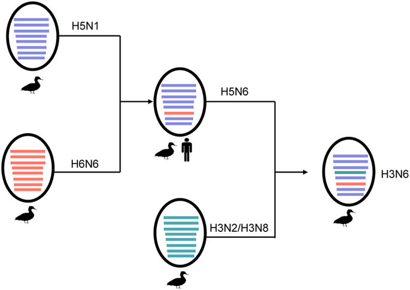
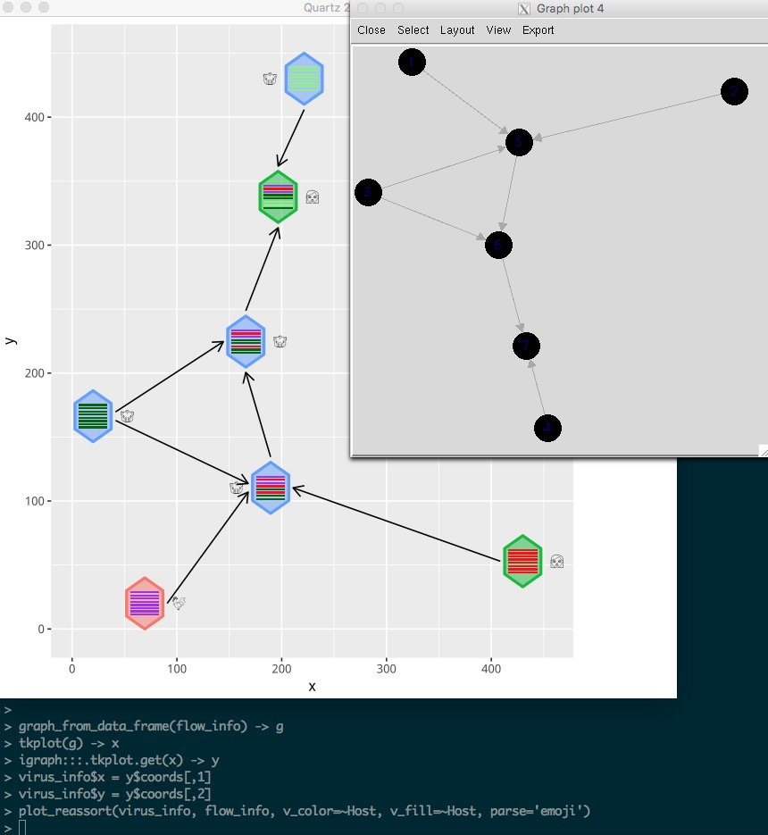
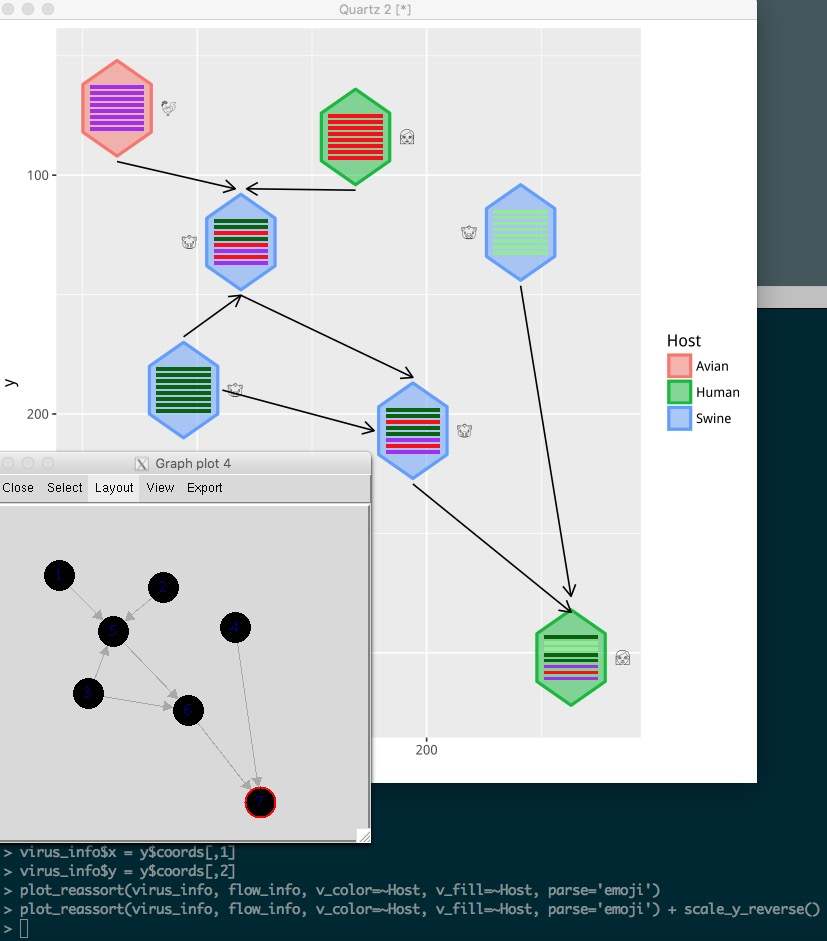

```{r style, echo=FALSE, results="asis", message=FALSE}
knitr::opts_chunk$set(tidy = FALSE,
		   message = FALSE)
```


```{r echo=FALSE, results="hide", message=FALSE}
library("seqcombo")
library(tibble)
library(emojifont)
library(ggplot2)
```


Reassortment is an important strategy for influenza A viruses to introduce a HA
subtype that is new to human populations, which creates the possibilities of
pandemic.




A diagram showed above (Figure 2 of `doi:10.1038/srep25549`) is widely used to
illustrate the reassortment events. While such diagrams are mostly manually draw and
edit without software tool to automatically generate. Here, I implemented the
`hybrid_plot` function for producing publication quality figure of
reassortment events.


```{r fig.width=8, fig.height=7}
library(tibble)
library(ggplot2)


n <- 8

virus_info <- tibble(
    id = 1:7,
    x = c(rep(1990, 4), rep(2000, 2), 2009),
    y = c(1,2,3,5, 1.5, 3, 4),
    segment_color = list(
        rep('purple', n),
        rep('red', n),
        rep('darkgreen', n),
        rep('lightgreen', n),
        c('darkgreen', 'darkgreen', 'red', 'darkgreen', 'red', 'purple', 'red', 'purple'),
        c('darkgreen', 'darkgreen', 'red', 'darkgreen', 'darkgreen', 'purple', 'red', 'purple'),
        c('darkgreen', 'lightgreen', 'lightgreen', 'darkgreen', 'darkgreen', 'purple', 'red', 'purple'))
)

flow_info <- tibble(from = c(1,2,3,3,4,5,6),
                    to = c(5,5,5,6,7,6,7))
hybrid_plot(virus_info, flow_info)
```

The `hybrid_plot` requires two tibble data frame of virus information and
genetic flow information.


Users need to provide `x` and `y` positions to plot the virus, this make sense
for geographically and temporally information are usually available in such
phylodynamic study and can be employed to set `x` or `y` to provide more
information and help interpretation of the reassortment events.


We use hexagon to represent virus. Users can set the virus outer boundary color by `v_color` and fill the virus by
`v_fill`. Color of line segments that indicate the genetic flow relationship can
be specify via `l_color` parameter.

```{r fig.width=8, fig.height=7}
hybrid_plot(virus_info, flow_info, v_color='firebrick', v_fill='darkgreen', l_color='steelblue')
```


We usually have more information to present, for example host information and HA
subtype *etc.* and these information can be used to color the virus either by
`v_color` or `v_fill`

```{r fig.width=8, fig.height=7}
virus_info$Host = c("Avian", "Human", rep("Swine", 4), "Human")
hybrid_plot(virus_info, flow_info, v_color=~Host, v_fill=~Host)
```


The relative virus size can also be specify if a `virus_size` column is
available in the input `virus_info` data.


```{r fig.width=8, fig.height=7}
virus_info$virus_size <- c(rep(1, 3), 2, 1, 1, 1.5)
hybrid_plot(virus_info, flow_info, v_color=~Host, v_fill=~Host)
```

If `label` and `label_position` coloumns are available, the virus labels (virus
name or other information) will be added automatically.


```{r fig.width=9, fig.height=8}
virus_info$label <- c("Avian", "Human\nH3N2", "Classic\nswine\nH1N1", "Eurasian swine",
                      "North American swine\n triple reassrotant H3N2",
                      "North American swine\n triple reassortant H1N2", "2009 Human H1N1")
virus_info$label_position <- c('left', 'left', 'left', 'below', 'below', 'upper', 'below')
hybrid_plot(virus_info, flow_info, v_color=~Host, v_fill=~Host)
```


User can use `asp` to set the aspect ratio of hexagons, `asp < 1` for
thick/short and `asp > 1` for thin/tall.

```{r fig.width=10, fig.height=9, out.width="80%"}
hybrid_plot(virus_info, flow_info, v_color=~Host, v_fill=~Host, asp=2)
```


The output of `hybrid_plot` is a `ggplot` object and users can use `ggplot2`
to modify the details.

```{r fig.width=7.5, fig.height=7}
title <- "Reassortment events in evolution of the 2009 influenza A (H1N1) virus"
caption <- 'Gene segments: PB2, PB1, PA, HA, NP, NA, M, NS'
color <- c(Avian="purple", Human="red", Swine="darkgreen")

hybrid_plot(virus_info, flow_info, v_color=~Host, v_fill=~Host) +
    labs(caption=caption, title=title) +
    scale_color_manual(values=color) + scale_fill_manual(values=color) +
    scale_x_continuous(breaks=c(1990, 2000, 2009)) +
    xlab(NULL) + ylab(NULL) + theme_minimal() +
    theme(axis.line.y = element_blank(),
          axis.text.y = element_blank(),
          axis.ticks.y = element_blank(),
          panel.grid.minor=element_blank(),
          panel.grid.major.y=element_blank(),
          legend.position = c(.95, .1)
          )
```

Top-down or bottom-up style is also supported.

```{r fig.width=9, fig.height=7}
x <- virus_info$x
virus_info$x <- virus_info$y
virus_info$y <- x
virus_info$label_position <- c(rep("right", 3), "left", "left", "right", "right")
hybrid_plot(virus_info, flow_info, v_color=~Host, v_fill=~Host) +
    scale_y_reverse() + scale_x_continuous(limits=c(0, 5.5))
```


User can also use Emoji to label the virus (host information in this example):

```{r fig.width=8, fig.height=7, fig.showtext=TRUE}
virus_info$label <- c("chicken", "woman", "pig", "pig", "pig", "pig", "woman")
hybrid_plot(virus_info, flow_info, v_color=~Host, v_fill=~Host,
              parse='emoji', t_size=8, t_color='firebrick') +
    scale_y_reverse()
```


In case you don't have xy-coordination information, you can use `set_layout`
function to auto setting the xy position using selected layout function.


```{r fig.height=7, fig.showtext=TRUE}
virus_info <- set_layout(virus_info, flow_info, layout="layout.kamada.kawai")
hybrid_plot(virus_info, flow_info, parse='emoji', t_size=8, t_color='firebrick')
virus_info <- set_layout(virus_info, flow_info, layout="layout.fruchterman.reingold")
hybrid_plot(virus_info, flow_info, parse='emoji', t_size=8, t_color='firebrick')
```


<!--
In case you don't have xy-coordination information, you can use `igraph` and
apply you favorite layout algorithm to auto-determine the xy-positions and then
using them to visualize the reassortment events as shown below:

```{r out.width='75%', echo=F}

```

You can also drag the dots for manual adjustment:

```{r out.width='75%', echo=F}

```
-->


